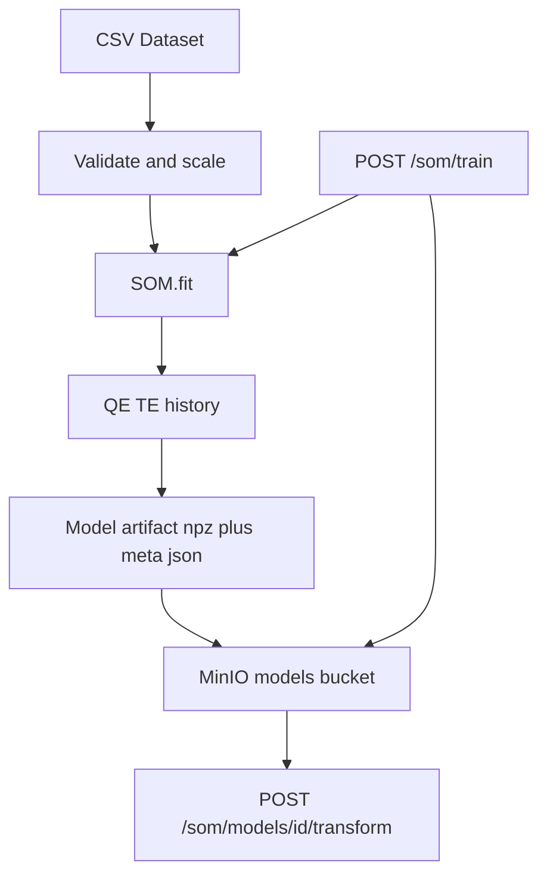
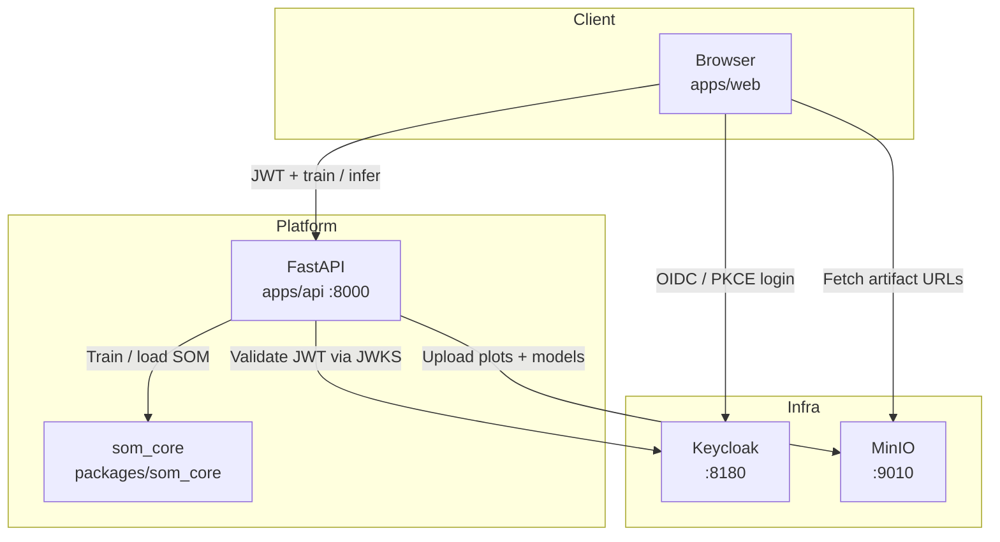

# Kohonen Self-Organising Map Platform

A platform for training **Kohonen Self-Organising Maps (SOMs)** on numeric CSV datasets. It includes a shared training library, a secured HTTP API, a web dashboard, object storage for plot artifacts, and Keycloak-based authentication.

---

## Monorepo layout

```text
kohonen/
├── apps/
│   ├── api/                 # FastAPI service (auth, train, MinIO upload)
│   └── web/                 # Dashboard UI (static)
├── packages/
│   └── som_core/            # Shared SOM training library (pip-installable)
├── infra/
│   └── keycloak/            # Realm import (client + demo user)
├── docker-compose.yml       # MinIO + Keycloak + API
└── README.md
```

| Path | Responsibility |
|------|----------------|
| `packages/som_core` | Algorithm + CSV helpers (`SOM`, `train_som_from_csv`, …) |
| `apps/api` | HTTP API, JWT validation, artifact upload |
| `apps/web` | Login-gated dashboard |
| `infra/keycloak` | IAM realm definition |

---

## Features

- **Vectorized SOM training** for arbitrary numeric feature matrices `(N × D)`
- **CSV → train → visualize → persist** pipeline via `train_som_from_csv` / `SOM.save`
- **Inference API** separated from training (`transform` / `predict` on saved models)
- **Topographic error** + per-iteration `history_` (QE, σ, α)
- **Web dashboard** to upload data, configure hyperparameters, view results, and score with the last model
- **REST API** with JWT protection (`POST /som/train`, model GET/infer routes)
- **MinIO** storage for plot PNGs and model artifacts (`model.npz` + `meta.json`)
- **Keycloak IAM** login before dashboard access
- Baseline RGB demos preserved (`train` / `train_vectorized`) for the original challenge comparison

---

## Architecture





| Service   | Role                         | URL                         |
|-----------|------------------------------|-----------------------------|
| Dashboard | Web UI                       | http://localhost:8000       |
| API docs  | OpenAPI / Swagger            | http://localhost:8000/docs  |
| Keycloak  | Identity provider            | http://localhost:8180       |
| MinIO API | Object storage               | http://localhost:9010       |
| MinIO UI  | Console                      | http://localhost:9011       |

---

## Quick start

### Prerequisites

- Docker and Docker Compose
- Ports available: `8000`, `8180`, `9010`, `9011`

### Run the stack

```bash
cd kohonen
docker compose up -d --build
```

Wait ~30–60 seconds on first boot for Keycloak to import the realm, then open:

**http://localhost:8000**

### Demo credentials

| System   | Username | Password   |
|----------|----------|------------|
| Dashboard (Keycloak) | `demo` | `demo` |
| Keycloak admin       | `admin` | `admin` |
| MinIO                | `minioadmin` | `minioadmin` |

Stop the stack:

```bash
docker compose down
```

---

## Using the dashboard

The UI has two tabs: **Train** and **Predict**.

1. Sign in with Keycloak (`demo` / `demo`).
2. On **Train**, upload a CSV with a header row (features must be numeric).
3. Enter feature columns (comma-separated or JSON array).
4. Optionally set a label column (used only for BMU coloring).
5. Configure map size, iterations, seed, scaling, and online sampling.
6. Click **Submit** — a loader shows while training runs.
7. View metrics (`model_id`, QE, TE) and MinIO-backed plots (component planes + BMU projection).
8. Switch to **Predict**, confirm/paste a `model_id` (auto-filled after training), upload a CSV, and score via `/transform` or `/predict`.

**Example (Iris):**

- Features: `sepal_length, sepal_width, petal_length, petal_width`
- Label: `species`

Sample data: [`../IRIS.csv`](../IRIS.csv)

---

## API

Interactive docs: http://localhost:8000/docs

### Public endpoints

| Method | Path       | Description                |
|--------|------------|----------------------------|
| `GET`  | `/`        | Dashboard UI               |
| `GET`  | `/health`  | Liveness / dependency info |
| `GET`  | `/config`  | Public OIDC client config  |

### Authenticated endpoints

Require `Authorization: Bearer <access_token>`.

| Method | Path                                 | Description                                      |
|--------|--------------------------------------|--------------------------------------------------|
| `GET`  | `/me`                                | Current user claims                              |
| `POST` | `/som/train`                         | Train SOM from uploaded CSV; persist model       |
| `GET`  | `/som/models/{model_id}`             | Load model `meta.json` from MinIO                |
| `POST` | `/som/models/{model_id}/transform`   | Score rows → BMU coordinates `(x, y)`            |
| `POST` | `/som/models/{model_id}/predict`     | Score rows → flat BMU indices                    |

### Train request (multipart form)

| Field              | Required | Description                                      |
|--------------------|----------|--------------------------------------------------|
| `file`             | yes      | CSV upload                                       |
| `feature_columns`  | yes      | JSON array or comma-separated names              |
| `label_column`     | no       | Label for BMU coloring                           |
| `width` / `height` | no       | Map size (default `10`)                          |
| `n_iterations`     | no       | Training iterations (default `1000`)             |
| `seed`             | no       | RNG seed (default `42`)                          |
| `scale`            | no       | Z-score features (default `true`)                |
| `online`           | no       | One random sample per iteration (default `false`)|
| `alpha0`           | no       | Initial learning rate (default `0.1`)            |

### Example train response

```json
{
  "job_id": "9cd0b11aca2e",
  "model_id": "9cd0b11aca2e",
  "requested_by": "demo",
  "quantization_error": 0.38,
  "topographic_error": 0.12,
  "history": [{"iteration": 1, "qe": 1.2, "sigma": 5.0, "alpha": 0.1}],
  "artifacts": {
    "components": {
      "path": "s3://som-artifacts/9cd0b11aca2e/som_components.png",
      "url": "http://localhost:9010/som-artifacts/9cd0b11aca2e/som_components.png"
    },
    "bmu": {
      "path": "s3://som-artifacts/9cd0b11aca2e/som_bmu.png",
      "url": "http://localhost:9010/som-artifacts/9cd0b11aca2e/som_bmu.png"
    },
    "model": {
      "path": "s3://som-artifacts/models/9cd0b11aca2e/model.npz",
      "url": "http://localhost:9010/som-artifacts/models/9cd0b11aca2e/model.npz"
    },
    "meta": {
      "path": "s3://som-artifacts/models/9cd0b11aca2e/meta.json",
      "url": "http://localhost:9010/som-artifacts/models/9cd0b11aca2e/meta.json"
    }
  }
}
```

### Model artifact layout (MinIO)

```text
som-artifacts/
├── {job_id}/som_components.png
├── {job_id}/som_bmu.png
└── models/{model_id}/
    ├── model.npz      # weights, scaler, embedded meta
    └── meta.json      # metrics, schema, requester, timestamps
```

`model_id` equals `job_id` so plots and the model share one namespace.

### Inference request

Multipart form on `/transform` or `/predict`:

| Field             | Required | Description                                         |
|-------------------|----------|-----------------------------------------------------|
| `file`            | one of   | CSV with the same feature columns as training       |
| `rows`            | one of   | JSON array of objects or numeric arrays             |
| `feature_columns` | no       | Override; defaults to columns stored in `meta.json` |

### Example `curl` (password grant for automation)

```bash
TOKEN=$(curl -s -X POST "http://localhost:8180/realms/som/protocol/openid-connect/token" \
  -d "client_id=som-ui" \
  -d "username=demo" \
  -d "password=demo" \
  -d "grant_type=password" | python3 -c "import sys,json; print(json.load(sys.stdin)['access_token'])")

curl -X POST "http://localhost:8000/som/train" \
  -H "Authorization: Bearer $TOKEN" \
  -F "file=@../IRIS.csv" \
  -F 'feature_columns=["sepal_length","sepal_width","petal_length","petal_width"]' \
  -F "label_column=species" \
  -F "width=10" \
  -F "height=10" \
  -F "n_iterations=500"
```

---

## Local Python development

From the monorepo root:

```bash
python -m venv .venv
source .venv/bin/activate
pip install -e packages/som_core
pip install -r apps/api/requirements.txt
pip install -r apps/api/requirements-dev.txt

cd apps/api
WEB_ROOT=../web uvicorn main:app --reload --port 8000
```

### Tests

```bash
pip install -e packages/som_core
pip install -r apps/api/requirements-dev.txt
pytest packages/som_core/tests -q
```

### Library usage

```python
from som_core import train_som_from_csv, SOM

result = train_som_from_csv(
    "path/to/data.csv",
    feature_columns=["f1", "f2", "f3"],
    label_column="label",  # optional
    width=10,
    height=10,
    n_iterations=1000,
    seed=42,
    output_dir="./out",
)
print(result["quantization_error"], result["topographic_error"], result["artifacts"])

som = SOM.load("./out/model.npz")
coords = som.transform([[1.0, 2.0, 3.0]])
```

| Symbol | Package | Purpose |
|--------|---------|---------|
| `train` | `som_core` | Original nested-loop RGB trainer (baseline) |
| `train_vectorized` | `som_core` | Same semantics, NumPy-vectorized updates |
| `SOM` | `som_core` | Generic map: fit / transform / predict / save / load |
| `load_numeric_csv` | `som_core` | Load features (+ optional label) from CSV |
| `train_som_from_csv` | `som_core` | End-to-end: load → fit → plots → model → metrics |

---

## Configuration

Environment variables for `som-api` (see `docker-compose.yml`):

| Variable | Description |
|----------|-------------|
| `WEB_ROOT` | Path to dashboard static files |
| `WEB_CONCURRENCY` | Uvicorn worker processes (default `2`) |
| `MAX_CONCURRENT_TRAINS` | Max concurrent train jobs **per worker** (default `2`) |
| `TRAIN_QUEUE_TIMEOUT_SEC` | Wait time before `503` when at capacity (default `30`) |
| `TRAIN_THREAD_WORKERS` | Thread pool size for training (default = max trains) |
| `MINIO_ENDPOINT` | Internal MinIO host (`minio:9000`) |
| `MINIO_PUBLIC_URL` | Browser-reachable MinIO base (`http://localhost:9010`) |
| `MINIO_BUCKET` | Artifact bucket (`som-artifacts`) |
| `KEYCLOAK_URL` | Browser-facing Keycloak URL |
| `KEYCLOAK_INTERNAL_URL` | In-cluster Keycloak URL for JWKS |
| `KEYCLOAK_REALM` | Realm name (`som`) |
| `KEYCLOAK_CLIENT_ID` | Public OIDC client (`som-ui`) |

### Concurrency model (minimal production)

- Training runs in a **thread pool** so the API event loop stays responsive for auth/health/UI.
- A **semaphore** caps concurrent trains per worker; excess requests wait up to `TRAIN_QUEUE_TIMEOUT_SEC`, then return **503**.
- **Multiple Uvicorn workers** (`WEB_CONCURRENCY`) handle parallel users across processes.
- Effective train capacity ≈ `WEB_CONCURRENCY × MAX_CONCURRENT_TRAINS` (tune to CPU).

---

## Performance notes

Measured on the original RGB challenge path (same machine):

| Implementation   | Map / iterations     | Wall time |
|------------------|----------------------|-----------|
| `train` (loops)  | 100×100 / 1000       | ~154 s    |
| `train_vectorized` | 100×100 / 1000     | ~1.8 s    |

Complexity remains `O(I · N · W · H · D)`; vectorization removes Python grid-loop overhead. Use `online=True` for large `N`.

---

## Security notes (demo stack)

This compose stack is intended for **local development / challenge demos**:

- Default passwords are intentionally simple
- MinIO bucket policy allows public read of artifacts
- Keycloak runs in `start-dev` mode

Do not expose these defaults on a public network without hardening credentials, TLS, and bucket policies.

---

## License

Provided as part of the Mantel / Kohonen SOM challenge workspace. Adapt as needed for your submission or productisation review.
